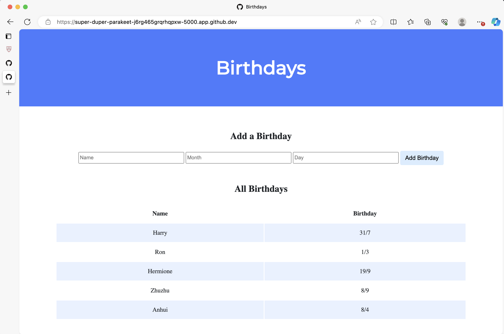

### A Web App to Document People's Bithday Built by Python

---

In `app.py`, the Flask web application is built with one route (/) that accepts both POST requests (after the if) and GET requests (after the else). 

`birthdays.db` is a SQLite database with one table, birthdays, that has four columns: id, name, month, and day. 