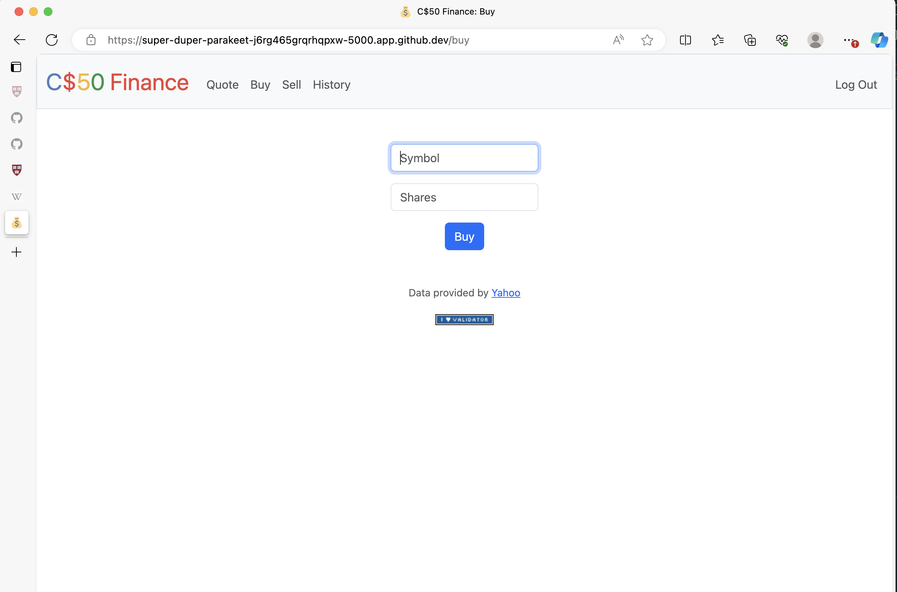

###  Finance Web App for Stock Porfolios Management

---

This tool enables users to check real stock prices, track portfolio values, and execute simulated buy and sell transactions. The app uses Yahoo Finance's API to fetch stock quotes in CSV format.

The implementation involves querying Yahoo Finance, parsing the CSV responses, and utilizing the fetched data to enable functionalities such as checking real-time stock prices and managing simulated stock portfolios.