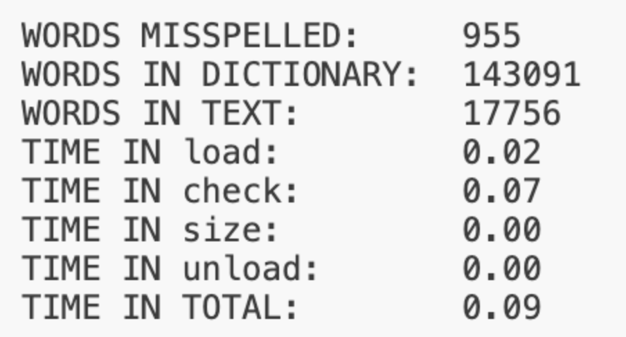
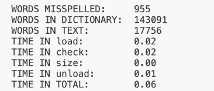

### Spell-checks Program

---

 This program is designed to spell-check a file in the following steps:
 - Load a dictionary of words from disk into memory. 
 - Write the words into the hash table according to the hash function (my solution's performance is very close to the staff's, but I will keep improving it when I come up with better ideas).

- Check input with the words from dictionary in the hash table.