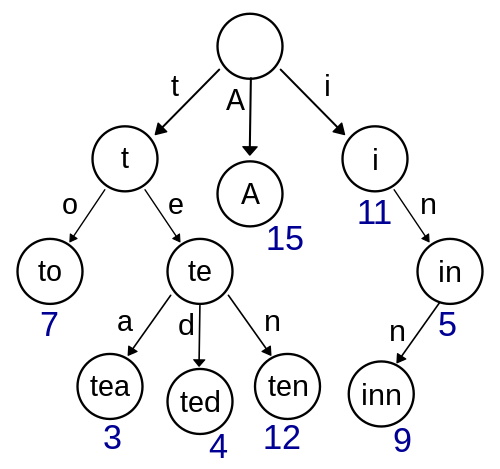

### Check the Dog's Name in the Trie 

---

 [Trie](https://en.wikipedia.org/wiki/Trie) is implemented through the creative use of several structs called `node`. In this program's context, each node in a trie has an array of (potential) children, with size 26—one potential child for each letter of the alphabet! 
 
 Adding words to this trie: for every letter in a word—we create a new node child whose parent is either the root node (for the first letter) or the previous letter (if not the first letter). On the very last letter, we set the `is_word` attribute of the child node to true. 
 
 Checking if a word is in this trie: following each letter of that word through our trie. If we get to the final letter and see that is_word is true, that name is in the trie!

 
 

 This program uses trie to check if a dog's name is in the given file or not.
